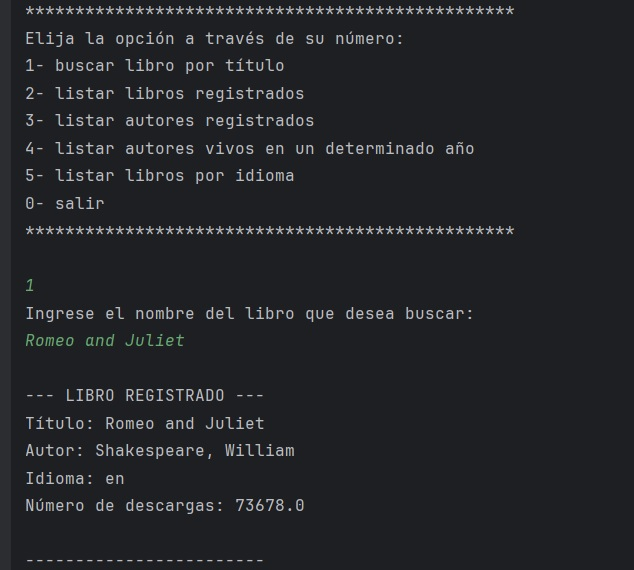
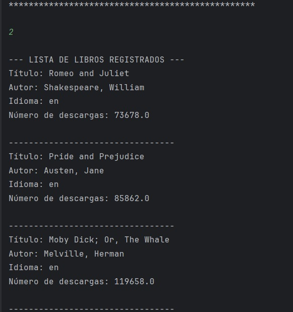
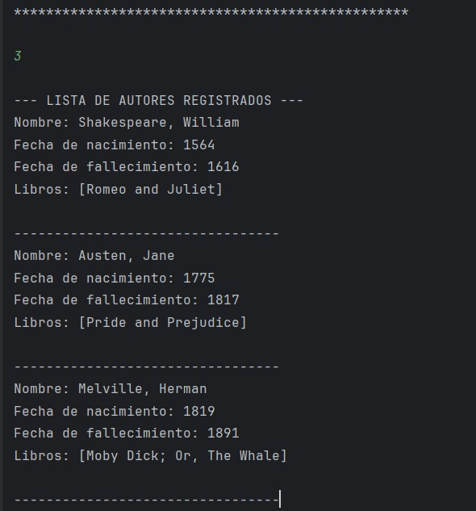
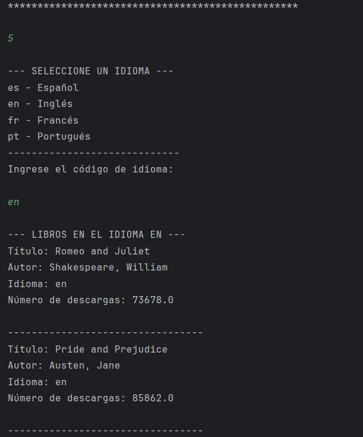

**<h1 align="center">:books:  DESAFÍO LITERALURA :books:</h1>**

**<h2 align="center"> Proyecto Alura Latam One - Practicando Spring Boot</h2>**

    

Este proyecto forma parte del curso **Alura Latam One - _Practicando Spring Boot._** En este desafío se realiza una aplicación de consola desarrollada con Spring Boot, que permite a los usuarios interactuar con la API de **Gutendex** (un índice de libros del Proyecto Gutenberg) y persistir la información de los libros y autores consultados en una base de datos local.

## :thinking: Funcionalidades 

La aplicación se ejecuta a través de un menú interactivo en la consola, ofreciendo las siguientes opciones de persistencia y consulta:

**1. Buscar Libro por Título:** El usuario introduce un título. La aplicación consulta la API de Gutendex, selecciona el primer resultado y lo persiste. Si el autor es nuevo, lo registra. Si ya existe, lo reutiliza para mantener la consistencia de la base de datos.
 - _Persistencia de Libro y Autor, manejo de relaciones @OneToMany y @ManyToOne._

 

**2. Listar Libros Registrados:** Recupera y muestra en consola la lista completa de todos los objetos Libro que han sido guardados previamente en la base de datos H2.
 - _Consulta simple: findAll()._

 

**3. Listar Autores Registrados:** Muestra una lista de todos los autores únicos que tienen al menos un libro asociado en la base de datos local. La consulta está optimizada para cargar los libros del autor en una sola petición.
 - _Consulta optimizada con FETCH JOIN para evitar el problema N+1._
   

 

**4. Listar Autores Vivos en Año:** Permite al usuario ingresar un año. La aplicación devuelve una lista de autores cuya fecha de nacimiento es anterior o igual a ese año, y cuya fecha de fallecimiento es posterior o igual a ese año, o es nula (están vivos).
 - _Consulta JPQL personalizada que compara fechas de nacimiento y fallecimiento (fechaDeNacimiento <= :anio AND (fechaDeFallecimiento IS NULL OR fechaDeFallecimiento >= :anio))._

 

**5. Listar Libros por Idioma:** Pide al usuario un código de idioma de dos letras (ej. 'es', 'en'). El sistema recupera y lista todos los libros en la base de datos que coincidan con ese código.
 - _Consulta por palabra clave de Spring Data JPA: findByIdioma(String idioma)._

 

## :computer: Tecnologías

- **Java** 17+ _Core Language_

- **Spring Boot** 3.x _Configuración y auto-configuración_

- **Spring Data JPA** Starter _Abstracción de persistencia_

- **H2 Database** Runtime _Base de datos en memoria para desarrollo_

- **Gutendex API** Cliente REST _Consumo de datos externos_

- **Jackson** Built-in _Conversión de JSON a objetos Java_

## :rocket: Inicio Rápido

### Requisitos

:white_check_mark: Asegúrate de tener el **JDK 17** o superior instalado.

### Ejecución

Abre el proyecto en tu IDE (IntelliJ, Eclipse, VS Code).

Ejecuta la clase principal ChallengeApplication.java.

La aplicación se ejecutará como un CommandLineRunner y automáticamente te presentará el menú de opciones.

### <ins> :gear: Estructura </ins> :gear:

La aplicación sigue un flujo estructurado al buscar contenido:

- **Menú y Entrada:** El usuario selecciona una opción del menú y proporciona una entrada (ej. Opción 1, el título de un libro).

- **Verificación Local (Persistencia):** Se utiliza el método libroRepository.existsByTitulo() para verificar inmediatamente si el libro ya se encuentra en la base de datos H2. Esto evita llamadas innecesarias a la API externa.

- **Consulta Externa:** Si es nuevo, la clase ConsumoAPI realiza la solicitud HTTP. La respuesta JSON es inmediatamente procesada por la clase ConvierteDatos (utilizando la librería Jackson) y se mapea a los records de Java (DatosLibro, DatosAutor).

- **Persistencia:**
    - Autor Único: La aplicación busca si el autor ya existe utilizando un método personalizado del repositorio (autorRepository.findByNombreContainingIgnoreCase()). Esto es crucial para mantener la integridad de los datos y evitar duplicados de autores.

    - Relación y Guardado: Si el autor existe, se reutiliza su ID. Si no, se crea y se guarda primero. Finalmente, la entidad Libro se crea, se vincula con la instancia persistente del Autor (estableciendo la relación @ManyToOne), y se guarda en la base de datos (libroRepository.save()).

- **Resultado:** La información del libro y autor registrados se imprime en la consola, confirmando la persistencia.

